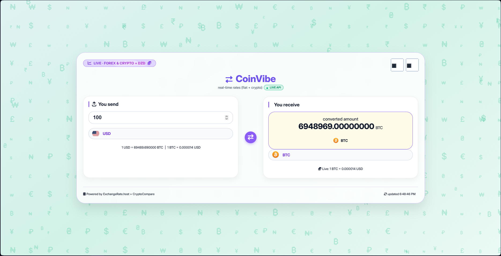

# CoinVibe – Live Currency & Crypto Converter

**CoinVibe** is a fun, interactive web tool that converts between fiat currencies and cryptocurrencies using real-time exchange rates. It features a dynamic canvas background with floating symbols that react to your mouse, a 3D card flip on swap, a pixel‑art eye tracker that also toggles dark mode, and automatic rate refresh.



## ✨ Features

- **Live rates** – Fetches real-time fiat (ExchangeRate-API) and crypto (CryptoCompare) prices.
- **DZD support** – Algerian Dinar included alongside 10+ major fiat currencies.
- **Crypto selection** – BTC, ETH, BNB, SOL, XRP, DOGE, ADA, MATIC, LTC, DOT.
- **Instant conversion** – Updates as you type or change currencies.
- **🎨 Dynamic background** – The entire background gradient and floating currency symbols change colour based on the selected “You send” currency.
- **🔄 3D card swap** – Clicking the swap button rotates both cards 180° in 3D space, physically exchanging their positions.
- **👀 Pixel eye tracker** – Two pixel‑style eyes follow your mouse and blink; click them to switch dark/light mode.
- **🌓 Dark / Light mode** – Smooth theme toggle with local storage persistence.
- **♿ Accessible selects** – Custom‑styled dropdowns with focus indicators for keyboard users.
- **🔄 Auto‑refresh** – Rates update every 60 seconds.
- **📱 Fully responsive** – Works on desktop, tablet, and mobile.

## 🚀 Live Demo

[View live demo](https://malaklabs.github.io/Coinvibe-Currency_CryptoConverter/)

## 🛠️ Tech Stack

- HTML5
- CSS3 (flexbox, grid, 3D transforms, keyframe animations, custom properties)
- Vanilla JavaScript (ES6+)
- External APIs:
  - [ExchangeRate-API](https://www.exchangerate-api.com/) – fiat rates
  - [CryptoCompare](https://min-api.cryptocompare.com/) – crypto prices
- Icons: Font Awesome 6, flag icons (lipis), cryptocurrency icons (atomiclabs)

## 📦 Installation & Usage

1. Clone the repository:
   ```bash
   git clone https://github.com/malaklabs/Coinvibe-Currency_CryptoConverter.git